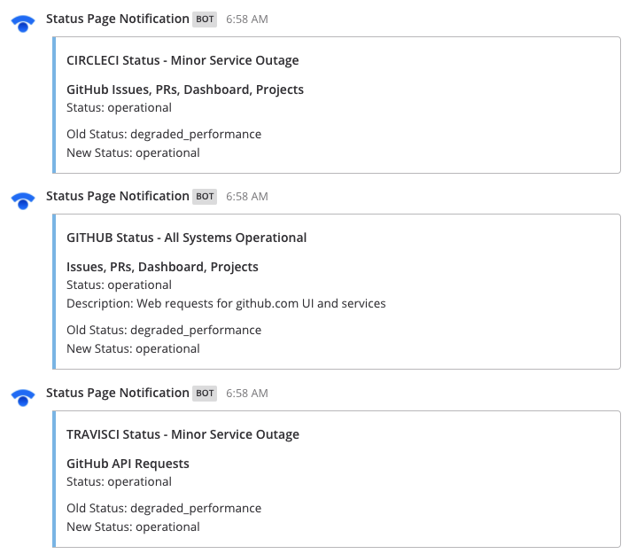

# Mattermost Statuspage Plugin [](https://circleci.com/gh/cpanato/mattermost-plugin-statuspage)

This plugin sends webhook notifications from Statuspage to Mattermost. Use it to get notified of system outages and of partially degraded services.

**Supported Mattermost Server Versions: 5.4+**

To see the plugin in action, join the **Statuspage** channel in our communtiy server at https://community.mattermost.com/core/channels/statuspage.

# 

## Installation

1. Go to the [releases page of this GitHub repository](https://github.com/cpanato/mattermost-plugin-statuspage/releases) and download the latest release for your Mattermost server.
2. Upload this file in the Mattermost **System Console > Plugins > Management** page to install the plugin, and enable it. To learn more about how to upload a plugin, [see the documentation](https://docs.mattermost.com/administration/plugins.html#plugin-uploads).

Next, to configure the plugin, follow these steps:

3. After you've uploaded the plugin in **System Console > Plugins > Management**, go to the plugin's settings page at **System Console > Plugins > Statuspage**.
4. Specify the team and channel to send messages to. For each, use the URL of the team or channel instead of their respective display names.
5. Select the username that this plugin is attached to. You may optionally create a new user account for your Statuspage plugin, which can act as a bot account posting Statuspage updates to a Mattermost channel.
6. Generate the Token that will be use to validate the requests.
7. Hit **Save**.
8. Next, copy the **Token** above the **Save** button, which is used to configure the plugin for your Statuspage account.
9. Go to your Statuspage account, paste the following webhook URL and specfiy the name of the service and the token you copied in step 8.

```
https://SITEURL/plugins/statuspage/webhook?service=SERVICENAME&token=TOKEN
```
